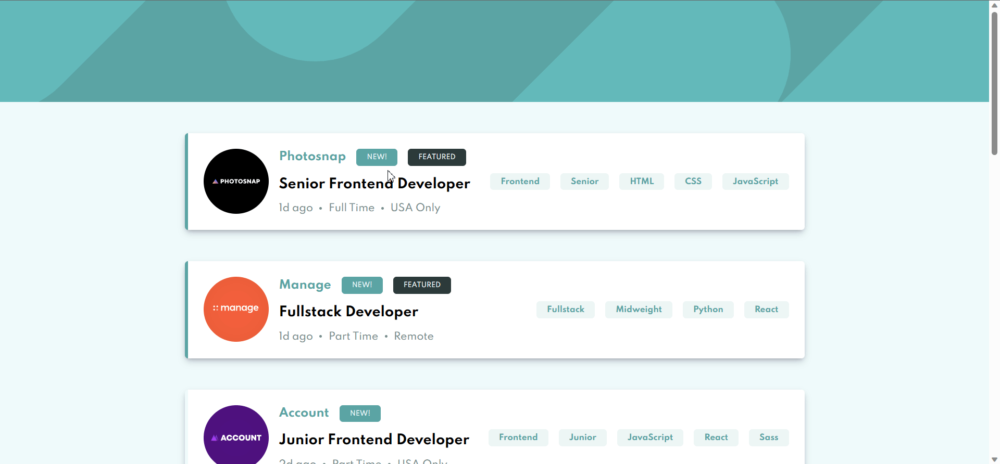

# Job Listings with Filtering

This repository contains a coding challenge focused on building a landing page that allows users to filter job listings based on selected categories.

## Brief

**Task:** create a landing page that closely resembles the provided design. You have the flexibility to use any tools or technologies of your choice to complete the challenge. If you wish to practice specific skills or tools, feel free to incorporate them.

### Technologies

- React
- React Redux

### Features

- View the landing page in an optimal layout based on their device's screen size.
- See hover states for all interactive elements on the page.
- Filter job listings dynamically based on the selected categories.

## Demo

Deployed on vercel: [https://filteredjoblist.vercel.app/](https://filteredjoblist.vercel.app/)
